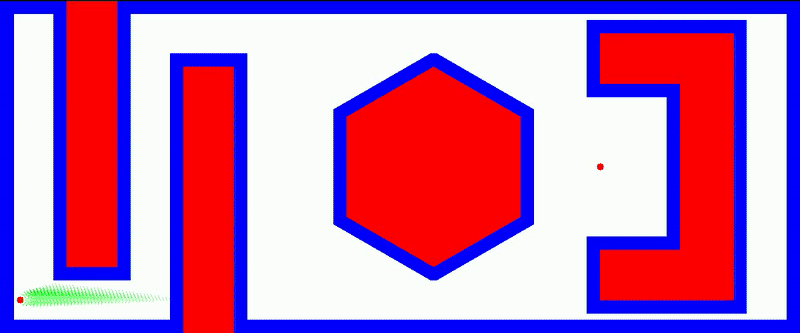

# A* Path Planning for Robotics

This repository contains an implementation of the **A* algorithm** for robotic path planning, developed as part of **ENPM 661: Planning for Robotics - Project 3 (Phase 1)**. The algorithm finds an optimal path while avoiding obstacles, considering robot clearance and movement constraints.

## Authors
- **Keyur Borad**  
- **Aryan Mishra**  
- **FNU Koustubh**  

---

## Features
✅ **A\* Algorithm Implementation** - Optimized pathfinding with heuristic search.  
✅ **Obstacle Avoidance** - Handles various obstacle shapes, including rectangles, hexagons, and concave obstacles.  
✅ **User-Defined Parameters** - Set robot clearance, step size, and start/goal positions.  
✅ **Visualization with OpenCV** - Generates a video (`output.mp4`) showing the search and final path.  

---

## Installation & Dependencies
Ensure you have Python installed along with the required dependencies:

```bash
pip install numpy opencv-python
```

---

## Usage

### 1. Run the Script
Execute the script using:

```bash
python3 a_star_FNU_aryan_keyur.py
```

### 2. User Inputs
During execution, the program will prompt you for:
- **Clearance from obstacles (in pixels)**  
- **Robot radius (in pixels)**  
- **Start position (x, y, θ)**  
- **Goal position (x, y, θ)**  
- **Step size (between 1 and 10 pixels per move)**  

### 3. Output
- **Terminal Output**: Displays the execution time and success message when the goal is reached.  
- **Generated Video (`output.mp4`)**:  
  - **Exploration (Green points)** - Shows the searched area.  
  - **Obstacle Map (Blue regions)** - Defines obstacles in the environment.  
  - **Final Path (Black line)** - The computed optimal path.  

---

## Project Details

### A* Algorithm Overview
A* is an informed search algorithm that finds the shortest path from a start node to a goal node. It uses:
- **Cost-to-Come (`g(n)`)**: Distance traveled so far.  
- **Cost-to-Go (`h(n)`)**: Estimated distance to the goal (Euclidean distance).  
- **Total Cost (`f(n) = g(n) + h(n)`)**: Determines the best path.  

### Movement Options
The robot can move in different directions:
- **Forward**  
- **+30° Turn**  
- **-30° Turn**  
- **+60° Turn**  
- **-60° Turn**  

These allow smooth navigation while respecting robot motion constraints.

---

## Example Run

```bash
    Enter the clearance from the obstacle in pixel: 10
    Enter the radius of the robot in pixel: 10
    Enter the start x coordinate: 30
    Enter the start y coordinate: 50
    Enter the initial heading: 0
    Enter the goal x coordinate: 900
    Enter the goal y coordinate: 250
    Enter the goal heading: 60
    Enter step size:
```


---

## License
This project is licensed under the **MIT License**.

---

### Contributions & Contact
For any issues, suggestions, or improvements, feel free to raise an issue or create a pull request.


